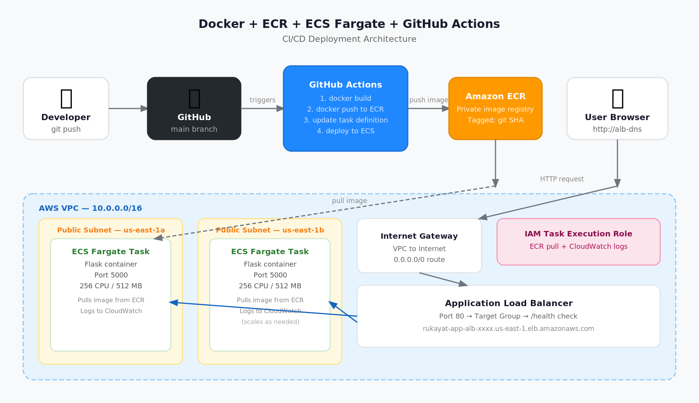
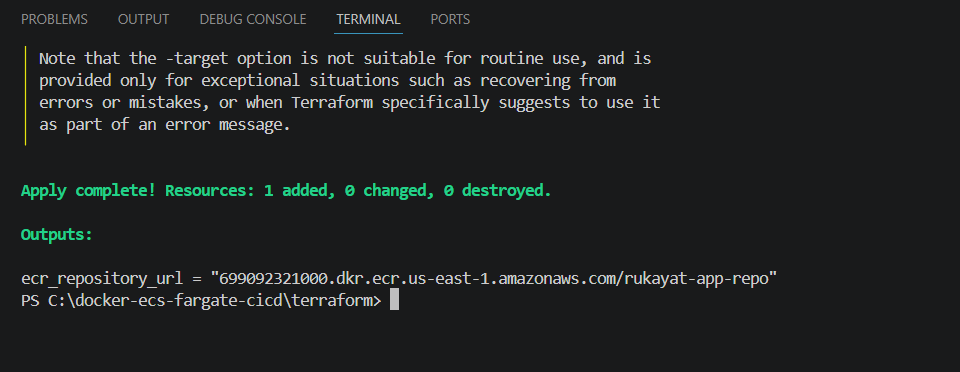
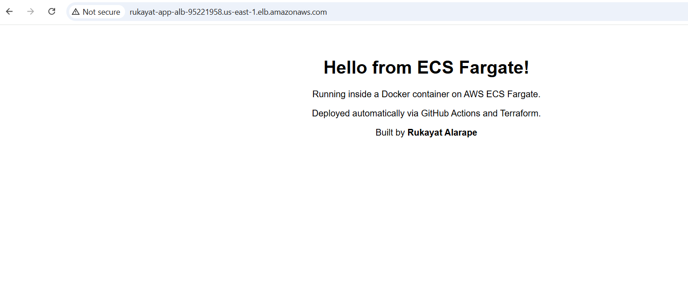
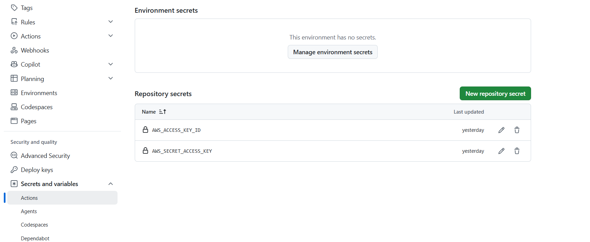
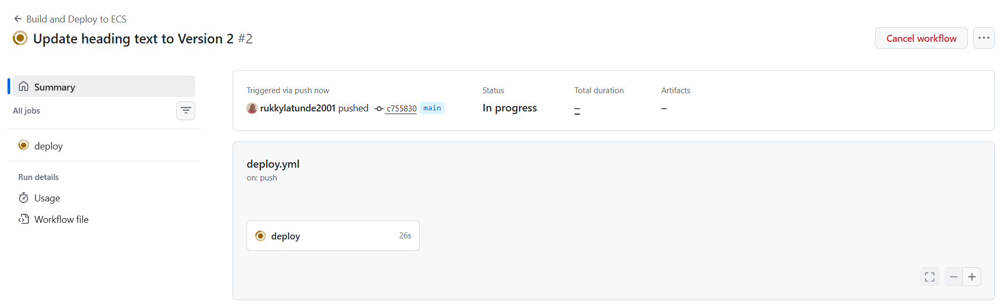
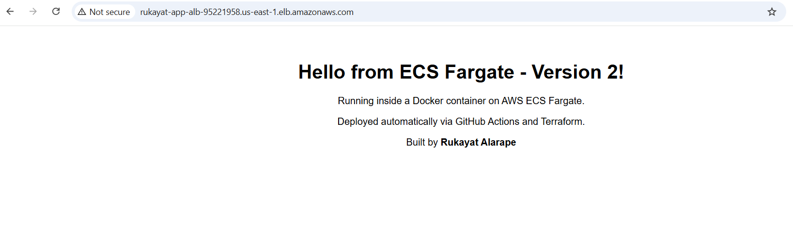

# Docker + ECR + ECS Fargate + GitHub Actions CI/CD


A Python Flask web application containerised with Docker, stored in a private AWS image registry, and deployed to run on AWS ECS Fargate — all provisioned with Terraform. A GitHub Actions pipeline automatically rebuilds and redeploys the application on every push to the main branch. No manual steps after the first deploy.

> **"One push to GitHub. Three minutes later, the update is live. That is what this project does."**

---

## Architecture



---

## What Terraform Provisions

| Terraform Resource | AWS Service | Purpose |
|---|---|---|
| `aws_ecr_repository` | Amazon ECR | Private registry that stores Docker images |
| `aws_vpc` | Amazon VPC | Isolated private network — 10.0.0.0/16 |
| `aws_subnet` (public-1) | Amazon VPC | Public subnet in us-east-1a |
| `aws_subnet` (public-2) | Amazon VPC | Public subnet in us-east-1b — ALB requires two AZs |
| `aws_internet_gateway` | Amazon VPC | Connects the VPC to the public internet |
| `aws_route_table` | Amazon VPC | Routes all internet traffic through the IGW |
| `aws_route_table_association` (×2) | Amazon VPC | Links both public subnets to the route table |
| `aws_security_group` (ALB) | Amazon EC2 | Allows port 80 inbound from anywhere |
| `aws_security_group` (ECS) | Amazon EC2 | Allows port 5000 inbound from the ALB only |
| `aws_lb` | Elastic Load Balancing | Application Load Balancer — stable public DNS name |
| `aws_lb_target_group` | Elastic Load Balancing | Pool of Fargate tasks the ALB sends traffic to |
| `aws_lb_listener` | Elastic Load Balancing | Listens on port 80, forwards to the target group |
| `aws_iam_role` | AWS IAM | Allows ECS to pull from ECR and write to CloudWatch |
| `aws_cloudwatch_log_group` | Amazon CloudWatch | Stores container logs |
| `aws_ecs_cluster` | Amazon ECS | Logical group that holds the service and tasks |
| `aws_ecs_task_definition` | Amazon ECS | Container blueprint — image, CPU, memory, ports |
| `aws_ecs_service` | Amazon ECS | Keeps one task running at all times, replaces on failure |

**Total: 17 resources provisioned by one `terraform apply`**

---

## Project Structure

```
docker-ecs-fargate-cicd/
├── .github/
│   └── workflows/
│       └── deploy.yml          # GitHub Actions CI/CD pipeline
├── terraform/
│   ├── provider.tf             # AWS provider and region
│   ├── variables.tf            # Reusable values — project name, region, port
│   ├── ecr.tf                  # ECR private image registry
│   ├── vpc.tf                  # VPC, subnets, IGW, route tables
│   ├── iam.tf                  # ECS task execution IAM role
│   ├── alb.tf                  # Load balancer, target group, security groups
│   ├── ecs.tf                  # ECS cluster, task definition, service
│   └── outputs.tf              # ALB DNS name, ECR URL, cluster and service names
├── app.py                      # Flask web application
├── requirements.txt            # Python dependencies
├── Dockerfile                  # Container build instructions
└── .gitignore                  # Excludes state files, .terraform/, __pycache__
```

---

## How to Use This Project

### Prerequisites
- [Docker Desktop](https://www.docker.com/products/docker-desktop/) installed and running
- [Terraform installed](https://developer.hashicorp.com/terraform/install) (AMD64 for Windows)
- [AWS CLI installed](https://aws.amazon.com/cli/) and configured (`aws configure`)
- An AWS IAM user with AdministratorAccess
- A GitHub account with the repository already created

### Deploy

```bash
# 1. Clone the repo
git clone https://github.com/rukkylatunde2001/docker-ecs-fargate-cicd.git
cd docker-ecs-fargate-cicd

# 2. Deploy ECR first — the Docker image must exist before the rest of the infrastructure
cd terraform
terraform init
terraform apply -target="aws_ecr_repository.app"

# 3. Authenticate Docker with ECR and push the image
aws ecr get-login-password --region us-east-1 | docker login --username AWS --password-stdin 699092321000.dkr.ecr.us-east-1.amazonaws.com

docker build -t rukayat-app-repo .
docker tag rukayat-app-repo:latest 699092321000.dkr.ecr.us-east-1.amazonaws.com/rukayat-app-repo:latest
docker push 699092321000.dkr.ecr.us-east-1.amazonaws.com/rukayat-app-repo:latest

# 4. Deploy the remaining infrastructure
terraform apply
```

After apply, Terraform prints the ALB DNS name. Visit `http://[alb-dns-name]` in the browser to see the live application.

To enable the GitHub Actions pipeline, add two secrets in the repository under Settings → Secrets and variables → Actions:
- `AWS_ACCESS_KEY_ID`
- `AWS_SECRET_ACCESS_KEY`

From this point, every push to main triggers an automatic deploy.

### Destroy

```bash
terraform destroy
```

All resources are deleted in one command. The ECR repository has `force_delete = true` so it will be removed even if it still contains images.

---

## How It Was Built — Step by Step

### Step 1 — Create the Flask Application

I started by writing the web application in `app.py`. It has a home route that returns an HTML page and a `/health` route that the load balancer uses to check whether the container is healthy. The ALB polls `/health` every 30 seconds and only routes traffic to tasks that return `200 OK`.

```python
from flask import Flask
app = Flask(__name__)

@app.route('/')
def home():
    return """<html><body style="font-family: Arial; text-align: center; padding: 50px;">
        <h1>Hello from ECS Fargate!</h1>
        <p>Running inside a Docker container on AWS ECS Fargate.</p>
        <p>Deployed automatically via GitHub Actions and Terraform.</p>
        <p>Built by <strong>Rukayat Alarape</strong></p></body></html>"""

@app.route('/health')
def health():
    return {'status': 'healthy'}, 200

if __name__ == '__main__':
    app.run(host='0.0.0.0', port=5000)
```

The `requirements.txt` file lists the only dependency:

```
flask==3.0.0
```

---

### Step 2 — Write the Dockerfile

The Dockerfile tells Docker how to build the container image. I used `python:3.12-slim` as the base image because it is minimal — just what Python needs to run, nothing extra. I copied the requirements file in first so Docker can cache the dependency install step and only re-run it when requirements change.

```dockerfile
FROM python:3.12-slim
WORKDIR /app
COPY requirements.txt .
RUN pip install --no-cache-dir -r requirements.txt
COPY app.py .
EXPOSE 5000
CMD ["python", "app.py"]
```

---

### Step 3 — Set Up Terraform Files

Instead of putting all resources in one `main.tf`, I split them into separate files by purpose. Terraform reads all `.tf` files in the folder together — the split is purely for organisation.

**provider.tf** — tells Terraform which cloud provider to use and which region to deploy into:

```hcl
terraform {
  required_providers {
    aws = {
      source  = "hashicorp/aws"
      version = "~> 5.0"
    }
  }
}

provider "aws" {
  region = var.aws_region
}
```

**variables.tf** — stores reusable values so I only have to change a name in one place:

```hcl
variable "aws_region"   { default = "us-east-1" }
variable "project_name" { default = "rukayat-app" }
variable "app_port"     { default = 5000 }
```

**ecr.tf** — the private registry where Docker images are stored:

```hcl
resource "aws_ecr_repository" "app" {
  name                 = "${var.project_name}-repo"
  image_tag_mutability = "MUTABLE"
  force_delete         = true

  image_scanning_configuration { scan_on_push = true }

  tags = {
    Name    = "${var.project_name}-ecr"
    Project = var.project_name
  }
}
```

**vpc.tf** — the network: VPC, two public subnets, internet gateway, and route table. The ALB requires subnets in at least two availability zones, which is why I created one in us-east-1a and one in us-east-1b:

```hcl
resource "aws_vpc" "main" {
  cidr_block           = "10.0.0.0/16"
  enable_dns_hostnames = true
  tags = { Name = "${var.project_name}-vpc" }
}

resource "aws_subnet" "public_1" {
  vpc_id                  = aws_vpc.main.id
  cidr_block              = "10.0.1.0/24"
  availability_zone       = "us-east-1a"
  map_public_ip_on_launch = true
  tags = { Name = "${var.project_name}-public-1" }
}

resource "aws_subnet" "public_2" {
  vpc_id                  = aws_vpc.main.id
  cidr_block              = "10.0.2.0/24"
  availability_zone       = "us-east-1b"
  map_public_ip_on_launch = true
  tags = { Name = "${var.project_name}-public-2" }
}

resource "aws_internet_gateway" "main" {
  vpc_id = aws_vpc.main.id
  tags   = { Name = "${var.project_name}-igw" }
}

resource "aws_route_table" "public" {
  vpc_id = aws_vpc.main.id
  route {
    cidr_block = "0.0.0.0/0"
    gateway_id = aws_internet_gateway.main.id
  }
  tags = { Name = "${var.project_name}-public-rt" }
}

resource "aws_route_table_association" "public_1" {
  subnet_id      = aws_subnet.public_1.id
  route_table_id = aws_route_table.public.id
}

resource "aws_route_table_association" "public_2" {
  subnet_id      = aws_subnet.public_2.id
  route_table_id = aws_route_table.public.id
}
```

**iam.tf** — the IAM role that lets ECS pull images from ECR and write logs to CloudWatch:

```hcl
resource "aws_iam_role" "ecs_task_execution" {
  name = "${var.project_name}-ecs-execution-role"

  assume_role_policy = jsonencode({
    Version = "2012-10-17"
    Statement = [{
      Action    = "sts:AssumeRole"
      Effect    = "Allow"
      Principal = { Service = "ecs-tasks.amazonaws.com" }
    }]
  })
}

resource "aws_iam_role_policy_attachment" "ecs_execution" {
  role       = aws_iam_role.ecs_task_execution.name
  policy_arn = "arn:aws:iam::aws:policy/service-role/AmazonECSTaskExecutionRolePolicy"
}
```

**alb.tf** — two security groups, the load balancer, target group, and listener:

```hcl
resource "aws_security_group" "alb" {
  name   = "${var.project_name}-alb-sg"
  vpc_id = aws_vpc.main.id

  ingress {
    from_port   = 80
    to_port     = 80
    protocol    = "tcp"
    cidr_blocks = ["0.0.0.0/0"]
  }
  egress {
    from_port   = 0
    to_port     = 0
    protocol    = "-1"
    cidr_blocks = ["0.0.0.0/0"]
  }
}

resource "aws_security_group" "ecs" {
  name   = "${var.project_name}-ecs-sg"
  vpc_id = aws_vpc.main.id

  ingress {
    from_port       = var.app_port
    to_port         = var.app_port
    protocol        = "tcp"
    security_groups = [aws_security_group.alb.id]
  }
  egress {
    from_port   = 0
    to_port     = 0
    protocol    = "-1"
    cidr_blocks = ["0.0.0.0/0"]
  }
}

resource "aws_lb" "app" {
  name               = "${var.project_name}-alb"
  internal           = false
  load_balancer_type = "application"
  security_groups    = [aws_security_group.alb.id]
  subnets            = [aws_subnet.public_1.id, aws_subnet.public_2.id]
}

resource "aws_lb_target_group" "app" {
  name        = "${var.project_name}-tg"
  port        = var.app_port
  protocol    = "HTTP"
  vpc_id      = aws_vpc.main.id
  target_type = "ip"

  health_check {
    path                = "/health"
    healthy_threshold   = 2
    unhealthy_threshold = 3
  }
}

resource "aws_lb_listener" "http" {
  load_balancer_arn = aws_lb.app.arn
  port              = 80
  protocol          = "HTTP"

  default_action {
    type             = "forward"
    target_group_arn = aws_lb_target_group.app.arn
  }
}
```

**ecs.tf** — the cluster, log group, task definition, and service:

```hcl
resource "aws_ecs_cluster" "main" {
  name = "${var.project_name}-cluster"
}

resource "aws_cloudwatch_log_group" "ecs" {
  name              = "/ecs/${var.project_name}"
  retention_in_days = 7
}

resource "aws_ecs_task_definition" "app" {
  family                   = "${var.project_name}-task"
  network_mode             = "awsvpc"
  requires_compatibilities = ["FARGATE"]
  cpu                      = "256"
  memory                   = "512"
  execution_role_arn       = aws_iam_role.ecs_task_execution.arn

  container_definitions = jsonencode([{
    name      = "${var.project_name}-container"
    image     = "${aws_ecr_repository.app.repository_url}:latest"
    essential = true
    portMappings = [{ containerPort = var.app_port, protocol = "tcp" }]
    logConfiguration = {
      logDriver = "awslogs"
      options = {
        "awslogs-group"         = "/ecs/${var.project_name}"
        "awslogs-region"        = var.aws_region
        "awslogs-stream-prefix" = "ecs"
      }
    }
  }])
}

resource "aws_ecs_service" "app" {
  name            = "${var.project_name}-service"
  cluster         = aws_ecs_cluster.main.id
  task_definition = aws_ecs_task_definition.app.arn
  desired_count   = 1
  launch_type     = "FARGATE"

  network_configuration {
    subnets          = [aws_subnet.public_1.id, aws_subnet.public_2.id]
    security_groups  = [aws_security_group.ecs.id]
    assign_public_ip = true
  }

  load_balancer {
    target_group_arn = aws_lb_target_group.app.arn
    container_name   = "${var.project_name}-container"
    container_port   = var.app_port
  }

  depends_on = [aws_lb_listener.http, aws_iam_role_policy_attachment.ecs_execution]
}
```

**outputs.tf** — prints useful values after apply:

```hcl
output "alb_dns_name"       { value = "http://${aws_lb.app.dns_name}" }
output "ecr_repository_url" { value = aws_ecr_repository.app.repository_url }
output "ecs_cluster_name"   { value = aws_ecs_cluster.main.name }
output "ecs_service_name"   { value = aws_ecs_service.app.name }
output "ecs_task_family"    { value = aws_ecs_task_definition.app.family }
```

---

### Step 4 — Deploy ECR First

The ECS task definition references a Docker image stored in ECR, so ECR must exist before I push an image and before the rest of the infrastructure can be built. I deployed just the ECR repository first using the `-target` flag:

```bash
cd terraform
terraform init
terraform apply -target="aws_ecr_repository.app"
```



---

### Step 5 — Build and Push the Docker Image

With ECR ready, I authenticated Docker with the registry, built the image, and pushed it:

```bash
aws ecr get-login-password --region us-east-1 | docker login --username AWS --password-stdin 699092321000.dkr.ecr.us-east-1.amazonaws.com

docker build -t rukayat-app-repo .
docker tag rukayat-app-repo:latest 699092321000.dkr.ecr.us-east-1.amazonaws.com/rukayat-app-repo:latest
docker push 699092321000.dkr.ecr.us-east-1.amazonaws.com/rukayat-app-repo:latest
```


---

### Step 6 — Deploy All Remaining Infrastructure

With the image in ECR, I ran the full apply to build everything else:

```bash
terraform apply
```

After apply, Terraform printed the ALB DNS name. I opened `http://[alb-dns-name]` in the browser and the Flask application loaded.




---

### Step 7 — Set Up GitHub Actions

I created the `.github/workflows/` folder at the **root** of the project (not inside the terraform folder) and added `deploy.yml`:

```yaml
name: Build and Deploy to ECS

on:
  push:
    branches: [main]

env:
  AWS_REGION:     us-east-1
  ECR_REPOSITORY: rukayat-app-repo
  ECS_SERVICE:    rukayat-app-service
  ECS_CLUSTER:    rukayat-app-cluster
  CONTAINER_NAME: rukayat-app-container
  TASK_FAMILY:    rukayat-app-task

jobs:
  deploy:
    runs-on: ubuntu-latest
    steps:
      - name: Checkout code
        uses: actions/checkout@v4

      - name: Configure AWS credentials
        uses: aws-actions/configure-aws-credentials@v4
        with:
          aws-access-key-id: ${{ secrets.AWS_ACCESS_KEY_ID }}
          aws-secret-access-key: ${{ secrets.AWS_SECRET_ACCESS_KEY }}
          aws-region: ${{ env.AWS_REGION }}

      - name: Login to Amazon ECR
        id: login-ecr
        uses: aws-actions/amazon-ecr-login@v2

      - name: Build, tag, and push image to ECR
        id: build-image
        env:
          ECR_REGISTRY: ${{ steps.login-ecr.outputs.registry }}
          IMAGE_TAG: ${{ github.sha }}
        run: |
          docker build -t $ECR_REGISTRY/$ECR_REPOSITORY:$IMAGE_TAG .
          docker push $ECR_REGISTRY/$ECR_REPOSITORY:$IMAGE_TAG
          echo "image=$ECR_REGISTRY/$ECR_REPOSITORY:$IMAGE_TAG" >> $GITHUB_OUTPUT

      - name: Download current task definition
        run: |
          aws ecs describe-task-definition \
            --task-definition ${{ env.TASK_FAMILY }} \
            --query taskDefinition > task-definition.json

      - name: Update task definition with new image
        id: task-def
        uses: aws-actions/amazon-ecs-render-task-definition@v1
        with:
          task-definition: task-definition.json
          container-name: ${{ env.CONTAINER_NAME }}
          image: ${{ steps.build-image.outputs.image }}

      - name: Deploy to ECS
        uses: aws-actions/amazon-ecs-deploy-task-definition@v1
        with:
          task-definition: ${{ steps.task-def.outputs.task-definition }}
          service: ${{ env.ECS_SERVICE }}
          cluster: ${{ env.ECS_CLUSTER }}
          wait-for-service-stability: true
```

I then added the two AWS secrets in the GitHub repository under Settings → Secrets and variables → Actions.



---

### Step 8 — Push the Code and Watch the Pipeline Run

I pushed all the project files to GitHub:

```bash
git init
git add .
git commit -m "Initial commit — Docker ECS Fargate CI/CD project"
git remote add origin https://github.com/rukkylatunde2001/docker-ecs-fargate-cicd.git
git push -u origin main
```

GitHub Actions picked it up immediately. I watched the pipeline run in the Actions tab.



---

### Step 9 — Test the Auto-Deploy

To confirm the pipeline works end to end, I changed the heading text in `app.py` to Version 2 and pushed:

```bash
git add app.py
git commit -m "Update heading text to Version 2"
git push
```

The pipeline ran automatically. A few minutes later I refreshed the browser and the updated text was live — no manual steps.



---

### Step 10 — terraform destroy

After verifying everything worked, I deleted all the resources:

```bash
terraform destroy
```


---

## Key Concepts Demonstrated

| Concept | How It Was Applied |
|---|---|
| **Docker** | Packaged the Flask app into a container image using python:3.12-slim |
| **ECR** | Stored versioned Docker images in a private AWS registry |
| **ECS Fargate** | Ran the container serverlessly — no EC2 instances to manage |
| **Application Load Balancer** | Provided a stable DNS name and distributed traffic to healthy tasks |
| **Health Checks** | ALB polls `/health` every 30 seconds before routing traffic |
| **Zero-downtime Deploys** | New task starts and passes health check before old task is stopped |
| **GitHub Actions** | Automated the full build → push → deploy pipeline on every commit to main |
| **Infrastructure as Code** | All 17 resources defined in Terraform, zero console clicking |
| **Least Privilege Networking** | ECS tasks only reachable through the ALB — direct internet access blocked |
| **Image Traceability** | Git commit SHA used as Docker image tag — every deploy traceable to its source code |

---

## Troubleshooting

**ECR login fails**
Make sure the login URL is just the registry address with no repository name at the end. The correct format is `699092321000.dkr.ecr.us-east-1.amazonaws.com` — not `…/rukayat-app-repo`.

**`terraform apply -target` gives "Invalid target" error**
Run `terraform init` first. The `-target` flag requires providers to be downloaded before it works.

**`terraform destroy` fails — ECR repository not empty**
GitHub Actions may have pushed a new image while destroy was running. `force_delete = true` is set on the ECR resource, so re-running `terraform destroy` will delete the repository and all images automatically.

**`terraform destroy` fails mid-way with "no such host" error**
This is a network connectivity issue — not an AWS error. Check that the internet connection is back, then run `terraform destroy` again. Terraform tracks what has already been deleted in the state file and will only attempt the resources that failed.

**ALB URL shows connection refused or does not load**
Always use `http://` not `https://` — port 443 is not configured. If the page still does not load, check the ECS service in the AWS Console to confirm the task is in RUNNING state and the health check is passing.

**GitHub Actions fails on "describe-task-definition"**
The ECS task definition must already exist before the pipeline can update it. `terraform apply` must be run before the first pipeline can succeed.

---

## About the Author

**Rukayat Alarape**
Data Analyst | Cloud Engineer Learner | Program Officer, University of Ibadan

- GitHub: [@rukkylatunde2001](https://github.com/rukkylatunde2001)
- Email: rukkylatunde2001@gmail.com
